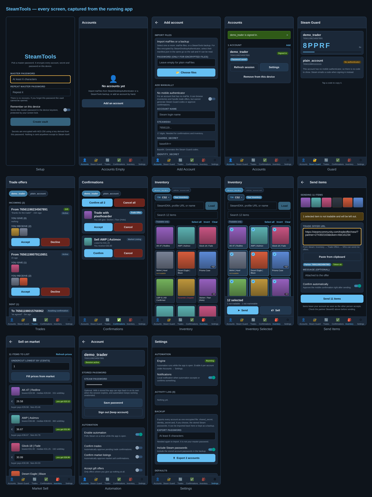

# SteamTools

A mobile app for managing Steam accounts: Steam Guard codes, trade offers,
mobile confirmations, inventory management and Community Market listings.

Built with **React Native / Expo** (JavaScript).

---

## Why React Native and not a web app

Steam sends no CORS headers, so a page running in a browser cannot call
`steamcommunity.com` or `api.steampowered.com` at all. React Native's `fetch` is
backed by the platform's native HTTP stack, which has no CORS layer, so the app
talks to Steam directly with no proxy or server in between.

---

## Features

### Steam Guard
- Generates 2FA codes for every stored account, with a live countdown.
- Corrects for clock drift against Steam's own clock, so codes stay valid even
  when the phone's time is off.
- Tap a code to copy it.

### Trade offers
- Incoming and outgoing offers with the items on both sides.
- Accept, decline and cancel.
- Gift offers (where you give up nothing) are marked as such.

### Mobile confirmations
- Lists everything Steam is waiting on: trades, market listings, account changes.
- Approve or cancel individually, or all at once.
- Bulk approval warns when account-level changes are in the batch.

### Inventory
- **Any public inventory, not just your own.** Paste a SteamID64, a profile URL
  or just a custom URL name (`b4nny`, or
  `https://steamcommunity.com/id/b4nny/inventory/`) and it loads. Vanity names
  are resolved through Steam's profile XML, so no API key is needed. If the URL
  carries a game in its fragment (`#440_2`) that game is selected too.
- Someone else's inventory is **read-only**: you can only send or sell items you
  own. To trade with them, go back to your own inventory, select items and paste
  their trade offer URL, which Steam does not expose through the inventory.
- **Apps button** to switch games, listing each appid next to a short name
  (`730 CS2`, `440 TF2`, `753 Steam`), plus a field for any other appid and
  context id.
- Search and a tradable-only filter.
- **Multi-select** with select-all, invert and clear.
- From the selection:
  - **Send to a trade offer URL** — the partner SteamID is parsed from the URL
    and shown before sending, and the resulting confirmation can be approved
    automatically.
  - **List on the Community Market** — prices can be filled in from the current
    market lowest with a configurable undercut, showing what you receive after
    fees per item and in total.

### Automation
Per account, with its own polling interval:
- Auto-confirm trade confirmations.
- Auto-confirm market listing confirmations.
- Auto-accept gift offers (only offers where you give up nothing).
- Auto-accept from a list of trusted SteamID64s.
- Optionally decline everything else.
- Local notifications when it acts, and an activity log.

Automation runs while the app is open. It polls accounts sequentially with an
error backoff, because Steam rate-limits aggressively.

### maFiles (import / export)
- Imports plain `.maFile` files from SteamDesktopAuthenticator.
- Imports SDA's **encrypted** maFiles when their `manifest.json` is selected in
  the same go (the salt and IV live there).
- Imports and exports encrypted SteamTools backups covering all accounts.
- **The Steam account password is stored in the maFile when one is present**, so
  a backup restores an account that can sign itself back in. Including passwords
  is a toggle at export time.
- Single-account export stays SDA-compatible.

---

## Security

| | |
|---|---|
| At rest | AES-256-CBC, key from PBKDF2-SHA256 (100k iterations) over your master password |
| Integrity | Encrypt-then-MAC with HMAC-SHA256, so a wrong password or an altered file is reported instead of yielding garbage |
| Exports | Same construction, 150k iterations, iteration count stored in the file so it can be raised later |
| Master password | Never stored, unless you opt into "remember on this device", which puts it in the iOS Keychain / Android Keystore behind your screen lock |
| Auto-lock | Configurable; locks after the app has been in the background long enough |
| Randomness | Platform CSPRNG only — the code throws rather than falling back to `Math.random` |

Secrets are only ever sent to Steam itself. There is no backend.

Auto-confirmation is deliberately limited to trade and market-listing
confirmations. Phone number changes, account recovery and API key registrations
are never approved automatically, since those are what account-takeover attempts
look like.

### Accounts are isolated from each other

React Native's `fetch` shares one process-wide native cookie jar, so signing in a
second account would otherwise clobber the first. Every request instead uses
`credentials: 'omit'` with a `Cookie` header built from that account's own
tokens, which keeps sessions separate and makes multi-account polling safe.

---

## Getting started

```bash
npm install
npm start          # then scan the QR code with Expo Go
npm run android    # or run on a connected device / emulator
npm run ios
```

First launch asks you to choose a master password, which encrypts everything on
the device. There is no recovery for it.

Then either import maFiles (Accounts → Add → Choose files) or add an account by
hand with its `shared_secret` and `identity_secret`.

### Accounts without a mobile authenticator

An account with no maFile can still be added: turn on **No mobile
authenticator** when adding it by hand. It works for browsing inventories,
reading trade offers, and accepting, declining or sending trades. Steam emails a
Guard code at sign-in and the app prompts for it.

What it cannot do, and why:

| | |
|---|---|
| Steam Guard codes | needs `shared_secret`, which only the authenticator has |
| Mobile confirmations | needs `identity_secret`, same reason |
| Market listings | every listing requires a confirmation |
| Unattended automation | nobody can read the emailed code, so it fails with a clear message rather than stalling |

Steam's own rules bite harder than the app's: an account with **no Steam Guard
at all cannot trade or use the Community Market**, and one with **email Guard
only puts every trade into a multi-day hold**. Only the mobile authenticator,
active for a week, lifts that. The app states this when you add such an account
rather than letting a trade fail confusingly later.

An imported *maFile* without a `shared_secret` is still rejected, because
holding that secret is the file's whole purpose - such a file is corrupt, not
authenticator-less.

### Signing in

- `shared_secret` alone is enough to generate Guard codes.
- `identity_secret` is additionally needed for confirmations.
- Storing the account password lets the app sign in and renew sessions on its
  own, which is what makes unattended automation work.

Login uses Steam's current `IAuthenticationService` flow: the password is
RSA-encrypted with Steam's public key, and the Guard code is generated and
submitted automatically when a `shared_secret` is stored. Sessions renew from the
long-lived refresh token.

---

## Screenshots



These are captured from the running app by `npm run ui-smoke`, not drawn by
hand. The account shown is a throwaway with randomly generated secrets, talking
to a fake Steam.

---

## Testing across operating systems

| Command | What it does | Where it runs |
|---|---|---|
| `npm test` | 109 unit + integration tests | any OS |
| `npm run lint` | ESLint over app and scripts | any OS |
| `npm run verify:platforms` | bundles for Android, iOS and web and checks each output | any OS |
| `npm run ui-smoke` | drives every screen in a browser against a fake Steam, saves screenshots | any OS with Chromium |
| `npm run verify:all` | all of the above | any OS |
| `npm run device android` | builds and launches on an emulator or USB device | any OS with the Android SDK |
| `npm run device ios` | builds and launches on a simulator or device | macOS only |
| `npm run device expo-go` | QR code, runs on any phone | any OS, no toolchain |
| `npm run verify:live` | reads **real** public Steam inventories, no account needed | any machine with plain internet |
| `npm run verify:live:auth` | signs in to **your** account and reads trades, confirmations, inventory and listings | your own machine |

**Bundling for every platform works on every OS** — Metro is pure JavaScript, so
a Linux machine can verify the iOS bundle. Only producing an *installable
binary* needs the platform's toolchain: Xcode for iOS (macOS only), the Android
SDK for Android. `npm run device ios` says so explicitly rather than failing
somewhere deep in a native build, and points at EAS Build for iOS without a Mac.

### Checking against real Steam

The unit and UI suites run against a fake Steam, which keeps them fast and
offline. `npm run verify:live` is the counterpart: it calls the app's own
`resolveProfile` and `getInventory` against the live site, so a pass means the
shipped code handles Steam's real responses.

```bash
npm run verify:live                                           # b4nny: TF2, CS2, Steam items
node scripts/verify-live.mjs https://steamcommunity.com/id/<name>/
node scripts/verify-live.mjs 76561197970825039 440
```

It only reads public data - no sign-in, no trades, no listings - and paces its
requests, because Steam rate-limits inventory reads per IP. Sandboxed CI
environments often block steamcommunity.com; the script says so plainly instead
of reporting a bug that is not there.

To exercise the signed-in half - login, trade offers, confirmations, your own
inventory and market listings - there is a second script:

```bash
export STEAM_ACCOUNT=yourname
export STEAM_PASSWORD='...'
export STEAM_SHARED_SECRET='base64=='      # generates the Guard code
export STEAM_IDENTITY_SECRET='base64=='    # optional, for confirmations
npm run verify:live:auth

# or, from a maFile you already have:
node scripts/verify-live-auth.mjs --mafile ./yourname.maFile
```

**Run it yourself, on your own machine.** Three properties make that safe:

- **Read-only by construction.** It does not import `acceptTradeOffer`,
  `sendTradeOffer`, `respondToConfirmation`, `createSellListing` or any other
  call that changes account state, so no run of it can move an item or accept a
  trade. A test enforces this, so a later edit cannot quietly break it.
- **Credentials never come from arguments**, only from the environment or a
  maFile, so they stay out of your shell history. Also enforced by a test.
- **Secrets are masked in the output** (`BGht…QE= [28 chars]`), so the result is
  safe to paste into a bug report. Also enforced by a test.

Steam treats this as a new sign-in and may email you about it. That is expected:
it is a real login through the same code path the app uses.

Do not send Steam credentials to anyone, including in a chat with an AI
assistant. A password together with `shared_secret` and `identity_secret` is
full control of the account, Steam Guard included.

### What the UI smoke test actually does

`scripts/ui-smoke.mjs` builds the app for web (react-native-web), serves it,
and drives it in headless Chromium while `scripts/steam-mock.mjs` answers every
Steam request. The same component, navigation and state code runs there as on a
phone, so it catches render crashes, dead buttons and broken navigation without
a device — and it asserts behaviour, not just that pages load:

- the password arrives at Steam RSA-encrypted, decrypted back with the mock's
  private key to prove it
- the Guard code rendered is a real five-character TOTP
- the inventory action bar sits inside the viewport and clears the tab bar
- cards actually paint their surface colour
- nothing is logged to the console as an error

Web is a **testing and preview target, not a shipping one**: `expo-secure-store`
has no web implementation, so "remember on this device" is inert there.

`.github/workflows/ci.yml` runs the unit suite on Ubuntu, macOS and Windows,
bundles all three platforms, runs the UI smoke test and uploads its screenshots,
and compiles native debug builds for Android (Ubuntu) and iOS (macOS).

---

## Development

```bash
npm test                              # 109 tests
npm run lint
npm run verify:platforms              # android + ios + web bundles
npm run ui-smoke                      # screens + screenshots
```

The suite runs against a mocked `fetch`, so it exercises real request
construction and response parsing without touching Steam:

- Crypto verified against Node's OpenSSL bindings, including decrypting the RSA
  output with a real private key.
- Guard codes checked against an independently transcribed reference across 500
  time slots.
- Login asserts the password reaches Steam RSA-encrypted and never in the clear.
- Automation asserts it never gives items away unprompted and never
  auto-approves phone-number, account-recovery or API-key confirmations.

### Layout

```
src/lib/       bytes, crypto (SHA/HMAC/PBKDF2/AES), RSA, randomness, sharing
src/steam/     guard, http, session, confirmations, trades, inventory, market, maFile
src/storage/   encrypted vault
src/state/     app context, automation engine
src/ui/        theme and shared components
src/screens/   the screens
scripts/       ui-smoke, steam-mock, verify-platforms, run-device
tests/         unit and integration tests
```

---

## Notes and limits

- **Automation only runs with the app open.** Mobile platforms do not allow
  indefinite background polling; iOS in particular will not keep a timer alive.
- **Market fees are an estimate.** The publisher's cut differs per game, so what
  you actually receive can differ by a cent or two.
- Steam rate-limits hard. Intervals below 30 seconds are not accepted, and price
  lookups are paced deliberately.
- A trade offer URL without a token cannot be used; Steam requires it.
- This is an unofficial tool and is not affiliated with or endorsed by Valve.
